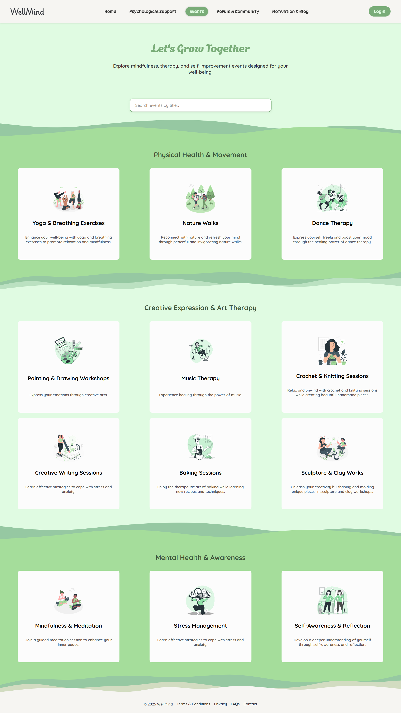

# 💙 WellMind: Your Path to Mental Wellness

Welcome to **WellMind**, a web-based platform designed to promote mental well-being through psychological support, event participation, and mood-based interaction. With a user-friendly interface and rich visual design, WellMind helps users easily book therapy sessions, find inspiration, interact with a community, and discover personalized content.

---

## 🖼️ Preview

### 🌐 Home Page

### 🧠 Psychological Support

### 📅 Events

### 🧑‍🤝‍🧑 Forum & Community

### 📝 Motivation & Blog

### 🔐 Login / Register

### 📆 Booking (Group & Individual)

> All screenshots are located in the `/screenshots` folder.

---

## 🚀 Features

- 🔁 **AJAX Integration**
  - Pulls **motivational quotes** from a local `.json` file and updates them every 10 seconds on the Home page.
  - Fetches **music suggestions** based on mood (happy, sad, chill, etc.) via a third-party API. Clicking the “Listen” button opens the song on Last.fm.

- 🧩 **jQuery Plugins & UI Widgets**
  - `Slick Carousel`: Featured topics slider on Forum page
  - `OverlayScrollbars`: Custom scrollbars
  - `jQuery Validation`: Form validation (Login/Register/Booking)
  - `Datepicker`: Book session calendar
  - `Autocomplete`: Event search bar
  - `Checkboxradio`: Styled "Remember Me" checkboxes

- 🧭 **Pages**
  - **Home**: Intro and navigation
  - **Psychological Support**: Book sessions and meet therapists
  - **Events**: Categorized mental health events with live search
  - **Forum & Community**: Carousel and static discussions
  - **Motivation & Blog**: Mood-based music + blog articles
  - **Login/Register**: Secure authentication
  - **Booking**: Book therapy sessions (Group or Individual)

---

